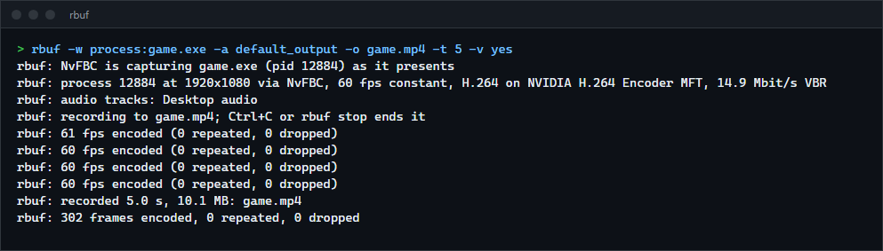

# rbuf

A ShadowPlay-style replay buffer and screen recorder for Windows: it keeps the last N seconds of your screen and audio in memory and saves them as an MP4 on a hotkey, or records straight to a file. Frames stay on the GPU from capture to the hardware encoder, every audio source (the whole desktop, the microphone, one game) gets its own track, and the command line follows gpu-screen-recorder's. For anyone who wants instant replay without a vendor's overlay, on any GPU vendor's encoder.

**Status:** v0.3.0, working on Windows 11 with an NVIDIA GPU (the only GPU it has been run on), capturing through NvFBC by default. Not released as a binary.

On an RTX 5070 Ti with a 1,200 fps game, recording costs the game 5.2% of its frame rate with rbuf and 5.0% with ShadowPlay, at the same settings; rbuf uses 92 MB against ShadowPlay's 724 MB, and records exclusive full-screen games, which Windows Graphics Capture cannot (see Compared with ShadowPlay and OBS).


## Features

- **Replay buffer:** the last `-r` seconds held in RAM as encoded packets, evicted a whole group of pictures at a time, so every saved clip starts on a keyframe and decodes. Saving copies references, not data, and writes on its own thread (20 s of 1080p60 HEVC in 7 ms here, into the file cache).
- **Recording:** straight to a file (`-o FILE`), or toggled on and off while the replay buffer runs.
- **Capture:** NVIDIA's NvFBC, the driver-level capture ShadowPlay uses, of a screen or of one process's frames as it presents them (`-w process:game.exe`), including exclusive full screen (see NvFBC below); Windows Graphics Capture of a screen or one window (by title, handle or the focused one); or DXGI Desktop Duplication. No hooks into the captured program.
- **GPU pipeline:** the captured texture is converted to NV12 by a compute shader (BT.709, limited range, scaled to the output size) and handed to the encoder through a DXGI device manager. No frame is copied to system memory.
- **Hardware encoding** through the GPU vendor's Media Foundation encoder (NVENC on NVIDIA, AMF on AMD, Quick Sync on Intel): H.264, HEVC and AV1, CBR, VBR or constant quality, constant or variable frame rate.
- **Audio tracks:** desktop audio (loopback), the default microphone, and any program by name or pid (`app:game.exe`, with its child processes) through Windows' process loopback. Each is a separate AAC track, kept continuous with silence when nothing plays.
- **Own MP4 muxer** (`avcC`, `hvcC`, `av1C`, `esds`, edit lists for tracks that start later, `colr` with the real colour space), checked with ffprobe and ffmpeg.
- **Control:** global hotkeys (Ctrl+Alt+F10 saves, Ctrl+Alt+F9 records), `rbuf save`, `rbuf record` and `rbuf stop` from any terminal or script, and Ctrl+C.

## How to install

Requires Windows 10 2004 or later (Windows 11 for a capture without the yellow border), a GPU with a hardware video encoder, and a recent stable Rust (built with 1.98.1).

```sh
git clone https://github.com/r3clusionn/replay-buffer
cd replay-buffer
cargo install --path .
```

## How to use

```sh
rbuf -w screen -f 60 -a default_output -a default_input -r 60 -o D:\Clips    # replay buffer, Ctrl+Alt+F10 saves
rbuf -w screen -k hevc -a default_output -a app:game.exe -r 120              # a separate track for the game's own sound
rbuf -w process:game.exe -a app:game.exe -r 120                             # only the game's frames and sound
rbuf -w window:Notepad -f 30 -o notepad.mp4 -t 10                           # record one window for 10 seconds
rbuf save                                                                    # from another terminal: save the replay
rbuf record                                                                  # start or stop a recording
rbuf stop
rbuf --list-capture-options                                                  # screens and windows
rbuf --list-encoders                                                         # GPUs and their hardware encoders
```

| Option | What it does |
|---|---|
| `-w screen\|screen:N\|focused\|window:TITLE\|hwnd:0xHANDLE\|process:NAME\|PID` | What to capture. Default: the primary screen. A title matches any window whose title contains it. `process:` (NvFBC only) records what that process presents: the game alone, without notifications or overlays, whether it has the focus or not. |
| `-f FPS` | Frame rate (default 60). |
| `-k h264\|hevc\|av1` | Codec (default h264). |
| `-bm cbr\|vbr\|qp` | Bitrate mode (default vbr; vbr peaks at 1.5 times the mean). |
| `-q PRESET\|NUMBER` | `low`, `medium`, `high`, `very_high` (default) or `ultra`; or kbit/s for cbr and vbr, 0 to 100 for qp. Presets scale with resolution and frame rate (very_high at 1080p60 is 14.9 Mbit/s for H.264, 70% of that for HEVC and AV1). |
| `-a SOURCE` | An audio track: `default_output`, `default_input`, `app:NAME` or `app:PID`. Repeat for more tracks. |
| `-r SECONDS` | Replay buffer length. Without it, rbuf records to `-o FILE`. |
| `-o PATH` | The recording, or the folder for clips (default: your Videos folder). Files are named `Replay_` or `Recording_` and the local date and time. |
| `-s WxH` | Output size (default: the captured size). |
| `-cursor yes\|no`, `-fm cfr\|vfr` | Capture the cursor; constant or variable frame rate (cfr repeats the last frame when nothing changed). |
| `-gop SECONDS` | Keyframe interval (default 1): how close to the asked length a clip starts. |
| `-capture auto\|nvfbc\|wgc\|dxgi` | `auto` (default) uses NvFBC for screens and processes and falls back to Windows Graphics Capture, saying why; windows go to Windows Graphics Capture (`nvfbc` captures a window through its process, which only works for programs that present through Direct3D). `dxgi` is DXGI Desktop Duplication (screens only, no cursor). |
| `-ram-limit MB` | Cap the replay buffer's memory; whole groups of pictures are dropped to stay under it. |
| `-hotkey-save KEYS`, `-hotkey-record KEYS` | For example `alt+f10`. The defaults avoid ShadowPlay's Alt+F10 and Alt+F9; a key another program holds is reported and the commands still work. |
| `-t SECONDS`, `-gpu N`, `-v yes` | Stop after a time; use another adapter; print frame statistics every second. |

Options from gpu-screen-recorder that rbuf does not have: merged audio sources (`-a "a|b"`), containers other than MP4, portal capture and the Linux-only ones.




## NvFBC

NvFBC (NVIDIA Frame Buffer Capture) is the driver-level capture ShadowPlay is built on: the driver copies the display's frame buffer, or the frames one process presents, into GPU memory without the Desktop Window Manager or DXGI. rbuf uses the same interface ShadowPlay does, NvFBC to Direct3D 9: rbuf's capture surfaces are Direct3D 11 textures shared with a Direct3D 9 device of its own, so a grabbed frame lands where the NV12 conversion reads it, and an event query on the Direct3D 9 device makes sure the grab has finished on the GPU first. `NvFBC64.dll` is loaded at run time, so machines without it fall back.

Two pieces are not in NVIDIA's public SDK and were read out of NvFBC64.dll: its log strings name the fields, and the checks in its code give the offsets.

- **Per-process capture** (`-w process:`): `NvFBCCreateParamsPrivateData`, a 200-byte structure passed at offset 0x40 of the create parameters with a capture mode (1) and the target pid. The driver then hands over the frames that process presents, at present time.
- **The Direct3D 9 interface's v3 setup parameters**, which the driver now expects (the older layouts in the SDK guide are rejected with "invalid pointer"): the surface array moved to offset 0x38.

How rbuf drives it:

- **Pacing:** NvFBC's own "wait for the next frame" grab spins a CPU core inside the driver (75% of one logical CPU at 60 Hz, measured). rbuf sleeps in `IDXGIOutput::WaitForVBlank`, a kernel wait, and takes the frame the driver already has with a non-blocking grab, on a grid of exactly one grab per output frame (every fourth blank of a 240 Hz display at 60 fps). The pacer takes the grab nearest to each output frame's time, so the picture stays within half a frame of the audio.
- **GPU priority:** rbuf puts itself in the realtime GPU scheduling class when it captures with NvFBC (Windows grants this to normal, non-elevated processes here). Without it, a game that fills the GPU with long frames keeps rbuf's few small jobs waiting: with a 245 fps game the encoder got 1 to 6 frames a second; with it, all 60, and the game's rate did not change. Windows Graphics Capture does not need it (the compositor captures) and lost 6% more game frames with it, so it is left at normal there.
- **CPU:** the CUDA interface rbuf used before took about twice the CPU of the Direct3D 9 one in the same 60 Hz grab loop (6 to 7.5% of one logical CPU against 2 to 3.5%); rbuf's own time with a 1,200 fps game fell from 5.7% to 3.9% (mean of six runs each), and its memory from 203 to 92 MB.
- **Presentation:** a full-screen game with the focus keeps its own flip mode (independent flip, or Legacy Flip in exclusive full screen) while rbuf captures it, by display or by process (PresentMon). One case is different: a game started while an NvFBC display capture is running drops to composed presentation, about 7 ms more latency here, when that capture ends (stopping rbuf mid-game), and stays there until it is restarted.
- **GeForce cards:** the driver only grants NvFBC sessions to callers that pass a private-data key. rbuf passes the key NVIDIA's own GeForce software uses (documented publicly by the nvidia-patch project). Nothing in the driver is patched.
- **The driver switch:** `rbuf --nvfbc-enable` (as administrator) calls the driver's `NvFBC_Enable`, which sets `NVFBCEnable` for the driver; it takes effect after the display driver restarts. `rbuf --nvfbc-disable` undoes it. `rbuf --nvfbc-status` shows what the driver answers for each interface, with and without the key.
- **One client at a time:** while NVIDIA's own Instant Replay is running, its helper (`nvsphelper64.exe`) holds NvFBC, and `auto` falls back to Windows Graphics Capture with a message. Turn Instant Replay off to use NvFBC.

**Tested state:** on the development machine (RTX 5070 Ti, driver 610.88, Windows 11 23H2), sessions were refused with "driver failure" until NvFBC was switched on with `rbuf --nvfbc-enable` and the display driver restarted. NVIDIA lists NvFBC on Windows as deprecated, so a future driver may stop serving it; `auto` then falls back.

## Compared with ShadowPlay and OBS

Every recorder recorded the same thing at the same settings: the screen (or the game), 1920x1080 at 60 fps, H.264 on NVENC, VBR 16 Mbit/s with a 32 Mbit/s peak, no B-frames, and the desktop sound as one AAC track. Those are ShadowPlay's "High" settings, read from its own log; rbuf ran with `-k h264 -bm vbr -q 16000`, OBS 32.1.2 with its NVENC encoder at preset P4. All recordings came out at 60.0 fps and 16.2 to 16.3 Mbit/s.

The game is `examples/game.rs`: a full-screen window with the focus, presenting through a flip-model swap chain with tearing allowed, kept GPU-bound by a pixel shader (`heavy:200`, about 1,220 fps; `heavy:1000`, about 245 fps), or in exclusive full screen (`exclusive`, Legacy Flip with full-screen optimisations off). Each condition ran three rounds of 25 s in a rotated order, measured over the last 17 s (`scripts/recorders/bench.py`). The NVIDIA App's service was stopped except for ShadowPlay and its own baseline, because its in-game overlay hook costs frames by itself; ShadowPlay is compared with the NVIDIA App running and not recording. Machine: Intel Core i9-14900KF, RTX 5070 Ti (driver 610.88), Windows 11 23H2, 1920x1080 at 240 Hz.

At about 1,200 fps, windowed:

| Recorder | Game frame rate | Of the rate without recording | 1% low | Recorder CPU (one logical CPU) | Recorder memory |
|---|---|---|---|---|---|
| none | 1,219 | 100% | 731 | | |
| **rbuf, NvFBC** | **1,156** | **94.8%** | 667 | 4.2% | 92 MB |
| rbuf, NvFBC by process | 1,155 | 94.7% | 683 | 3.9% | 92 MB |
| rbuf, Windows Graphics Capture | 1,112 | 91.1% | 964 | 3.1%, and 17.7% in dwm.exe | 70 MB |
| OBS, display capture | 1,073 | 88.0% | 733 | 9.3%, and 20.4% in dwm.exe | 241 MB |
| OBS, game capture | 1,180 | 96.7% | 779 | 8.7% | 242 MB |
| NVIDIA App running, not recording | 1,203 | 100% | 663 | | |
| ShadowPlay | 1,158 | 96.3% (95.0% of no NVIDIA App) | 631 | 3.1% (all its processes) | 724 MB |

At about 1,200 fps in exclusive full screen (Legacy Flip):

| Recorder | Game frame rate | Of the rate without recording | Recorder CPU |
|---|---|---|---|
| none | 1,219 | 100% | |
| **rbuf, NvFBC** | **1,154** | **94.7%** | 4.6% |
| rbuf, NvFBC by process | 1,154 | 94.7% | 4.3% |
| rbuf, Windows Graphics Capture | 1,198 | 98.3%: records the desktop, not the game | 1.6% |
| OBS, display capture | 1,165 | 95.6% | 8.6% |
| OBS, game capture | 1,179 | 96.7% | 10.0% |
| ShadowPlay | 1,155 | 96.1% of the NVIDIA App running (1,202) | 3.1% |

At about 245 fps, windowed: no recording 246.3 fps; rbuf with NvFBC 239.7 (97.3%); rbuf by process 239.3 (97.2%); rbuf with Windows Graphics Capture 240.0 (97.2%); OBS display capture 232.0 (94.2%); OBS game capture 239.0 (97.0%); ShadowPlay 241.0, 98.1% of the NVIDIA App running (245.7). Recorder CPU: rbuf 4.3%, ShadowPlay 2.4%, OBS 8.7 to 9.4%.

What the numbers say:

- **rbuf and ShadowPlay cost a game the same frames.** Both take NvFBC's frames; at 1,200 fps the game ran at 1,156 fps under rbuf and 1,158 under ShadowPlay, windowed, and 1,154 against 1,155 in exclusive full screen. ShadowPlay also needs the NVIDIA App running, which cost 1.3% (1,219 to 1,203 fps) before recording anything.
- **OBS's game capture is the lightest for the game** (96.7%), because it copies frames inside the game's own process. It does that by injecting a hook into the game, which rbuf does not do.
- **Exclusive full screen:** NvFBC, DXGI (OBS display capture) and OBS's game capture record it; Windows Graphics Capture records the desktop behind it.
- **Latency:** no recorder changed the game's presentation mode, and the display latency PresentMon reports moved by 0.1 to 0.4 ms (3.2 to 3.3 ms at 1,200 fps windowed, 2.4 to 2.5 ms in exclusive full screen).
- **CPU and memory:** rbuf used 4.2% of one logical CPU and 92 MB; ShadowPlay 3.1% and 724 MB across its processes; OBS 9% and 241 MB. Windows Graphics Capture and display capture also cost the Desktop Window Manager 18 to 20% of a CPU at 1,200 fps.

## How it works

| Stage | Thread | What happens |
|---|---|---|
| Capture | an NvFBC thread paced by vertical blanks, the Windows Graphics Capture callback, or a duplication thread | The new frame is copied (on the GPU) into one texture with its timestamp. |
| Pacer | its own, at the output frame rate | Converts the newest frame to NV12 with the compute shader, into one of 8 textures, and passes it to the encoder. With `-fm cfr` an unchanged frame is sent again. |
| Encoder | its own | The vendor's asynchronous Media Foundation transform; frames go in when it asks, pictures come out with their timestamps. Low-latency mode, no B-frames, a keyframe every `-gop` seconds (and at the start of a recording). |
| Audio | one per source | WASAPI capture as 48 kHz 16-bit stereo (Windows converts), timestamped from the performance counter, gaps filled with silence, encoded to AAC by Windows' encoder. |
| Main loop | main | H.264 and HEVC Annex B is turned into length-prefixed samples with the parameter sets moved to `avcC`/`hvcC`; AV1 temporal units lose their delimiters. Packets go into the ring and, while recording, into the file. |

Every timestamp is the performance counter in 100 ns units, the clock Windows Graphics Capture and WASAPI already use, so tracks line up without translation. The MP4 writer streams samples into `mdat` and writes the sample tables at the end; a track that starts later than the video gets an edit list.

## Results

rbuf alone, measured on the same machine with a 1920x1080 screen showing ffplay's full-screen moving test pattern, a 60 s replay buffer and one audio track, over 30 s after a 5 s warm-up (`scripts/perf.ps1 -Capture ...`):

| Codec, capture | rbuf CPU time | Working set | NVENC busy (nvidia-smi, every 0.5 s) |
|---|---|---|---|
| H.264, 14.9 Mbit/s VBR, NvFBC | 3.7% of one logical CPU | 152 MB | 17% average, 19% max |
| HEVC, 10.5 Mbit/s VBR, NvFBC | 4.1% | 137 MB | 18% average, 21% max |
| AV1, 10.5 Mbit/s VBR, NvFBC | 3.5% | 137 MB | 9% average, 10% max |
| H.264, 14.9 Mbit/s VBR, Windows Graphics Capture | 1.8% | 130 MB | 16% average, 17% max |

No frame was dropped in these runs or in the benchmark runs above (the pacer counts them). In a 10 s stretch of a recording of the 245 fps game, all 600 frames were distinct (ffmpeg's `mpdecimate`). Saving a 30.9 s, 58.8 MB clip took 13 ms (into the file cache).

Audio and video sync: `examples/sync.rs` flashes its window and plays a click in the same instant once a second. In a 10 s recording of the window the click arrives 18 ms after the flash in 9 of 10 pairs and 28 ms in the first, about one frame at 60 fps. That figure includes Windows' own audio output latency for the click, so it is what a viewer of the recording sees, not rbuf's error alone. Recording the whole screen instead, the flash appears after the click: 33 to 44 ms on average with NvFBC over three recordings, and 35 ms with Windows Graphics Capture.

## Verification

- `cargo test --release` runs 24 unit tests, 4 muxer tests against ffprobe, and 3 live tests.
- **Muxer:** real encoder output (H.264 from libx264, HEVC from libx265, AV1 from libaom, AAC from ffmpeg, all in `tests/fixtures`) is muxed by rbuf and ffprobe must report the codec, 320x180, 60 frames, keyframes exactly at frames 0 and 30, 2.0 s and a 48 kHz stereo AAC track; ffmpeg must decode the whole file without a message. An audio track that starts 0.5 s late must start at 0.500 s.
- **Colours** (live): `examples/patches.rs` draws eight colour patches; rbuf records the window with each codec and the decoded pixels must be within 4/255 of what was drawn. The worst channel error was 2/255 for H.264, HEVC and AV1 alike. A second test records the same window as part of the screen through NvFBC's Direct3D 9 interface (skipped when NvFBC is not available): also 2/255 for all three.
- **Cursor** (by hand): with the cursor held at one spot, NvFBC and Windows Graphics Capture recordings both show it there.
- **Exclusive full screen and process capture** (by hand): the game example in exclusive full screen clears to a colour whose green is always 76; the frame 10 s into an NvFBC recording, by display or by process, is that one colour (Windows Graphics Capture's is the desktop), and PresentMon shows Legacy Flip throughout.
- **Replay** (live): a 4 s buffer saved with `rbuf save` and stopped with `rbuf stop` must give one clip of 4 to 5.1 s that starts on a keyframe and decodes cleanly, and `rbuf save` with nothing running must fail.
- **Per-program audio** (by hand): with ffplay playing 440 Hz and another program 1,000 Hz, the desktop track carried both at equal amplitude and the `app:ffplay.exe` track the 440 Hz tone with nothing at 1,000 Hz.
- **Gap filling** (by hand): a 2 s tone played 2 s into a 6 s recording appears from 2.46 s to 4.46 s, with digital silence before and after and no gap in the track.
- Every mode was recorded and decoded once: H.264, HEVC and AV1; CBR, VBR and constant quality; window capture at a forced size; variable frame rate; desktop duplication.

### Bugs found while testing (worth knowing the pattern)

- **Per-program audio crashed with heap corruption** (`0xC0000374`). The `windows` crate implements `Drop` for `PROPVARIANT` with `PropVariantClear`, which freed the activation parameters on the stack. Found by bisecting with prints; the parameters are no longer dropped.
- **AV1 reported 1920x1088 for every size.** NVIDIA's AV1 encoder writes 1920x1088 as the maximum frame size in the sequence header and the real size in every frame. That is valid AV1, but ffprobe and players took the maximum as the video's size, and the colour test read the wrong pixels. rbuf rewrites the maximum to the real size in place (unit tested on libaom output). An earlier guess, that the encoder padded to 1088 and the padding should be blacked out, was wrong and was removed.
- **Desktop duplication dropped frames:** `AcquireNextFrame` holds the device lock while it waits, which starved the converter; it now waits 1 ms at a time. Its first frame was also thrown away (a present time of 0), so a static screen recorded nothing at the start.
- **NvFBC left the cursor out and pinned a core.** Setup flag bit 0 had been taken for "draw the cursor"; it is the separate cursor capture switch, and the cursor comes from a grab flag. The blocking grab spun inside the driver at 75% of one logical CPU; see Pacing under NvFBC.
- **NvFBC starved the encoder under a GPU-bound game:** at 245 fps the encoder got 1 to 6 frames a second; fixed with the realtime GPU scheduling class (see GPU priority under NvFBC).
- **NvFBC recordings could run a frame late against the sound** (52 ms instead of 35): capture and pacer each ran at 60 Hz on their own clocks, and depending on the phase every frame was the previous grab. The pacer now takes the grab nearest to its tick.
- **Measurement traps:** the first comparisons ran with a system dialog holding the focus, which made every NvFBC capture push the game into composed presentation, and with the NVIDIA App's overlay hook, which costs an uncapped game frames once its "press Alt+Z" banner disappears. Both made NvFBC look worse than it is; the numbers above were measured with the game focused and the NVIDIA App stopped unless it was being measured.
- **Hotkeys:** Alt+F10 and Alt+F9 (ShadowPlay's) and Alt+Shift+F10 were all taken on this machine by NVIDIA's overlay, hence the Ctrl+Alt defaults.

## Limits

- Only NVIDIA was tested. AMD's and Intel's Media Foundation encoders are reached through the same code but have never run it. The compute shader needs typed UAV stores on NV12 (Direct3D 11.3); a GPU without them is refused with a message, there is no fallback yet.
- Encoding goes through the vendors' Media Foundation transforms, not the NVENC or AMF SDKs directly, so options only the SDKs expose (lookahead, AQ, two-pass) are not available.
- 8-bit SDR only: no HDR or 10-bit capture.
- NvFBC: only the primary display has been tested; Instant Replay must be off; process capture only works for programs that present through Direct3D (most games and browsers, not GDI programs).
- Audio is 48 kHz stereo AAC at 192 kbit/s; surround is mixed down by Windows. Sources are separate tracks; mixing them into one is not supported.
- A window that changes size is scaled to the size the recording started with.
- `app:` needs the program to be running when rbuf starts.
- No settings file, tray icon or overlay; it is a command-line program.

## License

MIT (see `LICENSE`). No code from gpu-screen-recorder was used; only its command-line conventions were followed.
