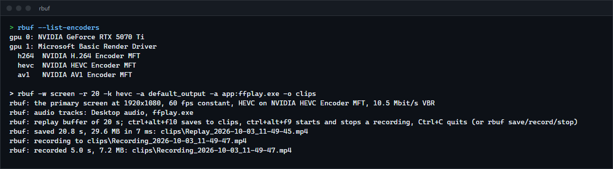
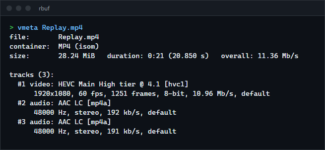

# rbuf

A ShadowPlay-style replay buffer and screen recorder for Windows: it keeps the last N seconds of your screen and audio in memory and saves them as an MP4 on a hotkey, or records straight to a file. Frames stay on the GPU from capture to the hardware encoder, every audio source (the whole desktop, the microphone, one game) gets its own track, and the command line follows gpu-screen-recorder's. For anyone who wants instant replay without a vendor's overlay, on any GPU vendor's encoder.

**Status:** v0.1.0, working on Windows 11 with an NVIDIA GPU (the only GPU it has been run on). Not released as a binary.



## Features

- **Replay buffer:** the last `-r` seconds held in RAM as encoded packets, evicted a whole group of pictures at a time, so every saved clip starts on a keyframe and decodes. Saving copies references, not data, and writes on its own thread (20 s of 1080p60 HEVC in 7 ms here, into the file cache).
- **Recording:** straight to a file (`-o FILE`), or toggled on and off while the replay buffer runs.
- **Capture:** Windows Graphics Capture of a screen or one window (by title, handle or the focused one), or DXGI Desktop Duplication. No hooks into the captured program.
- **GPU pipeline:** the captured texture is converted to NV12 by a compute shader (BT.709, limited range, scaled to the output size) and handed to the encoder through a DXGI device manager. No frame is copied to system memory.
- **Hardware encoding** through the GPU vendor's Media Foundation encoder (NVENC on NVIDIA, AMF on AMD, Quick Sync on Intel): H.264, HEVC and AV1, CBR, VBR or constant quality, constant or variable frame rate.
- **Audio tracks:** desktop audio (loopback), the default microphone, and any program by name or pid (`app:game.exe`, with its child processes) through Windows' process loopback. Each is a separate AAC track, kept continuous with silence when nothing plays.
- **Own MP4 muxer** (`avcC`, `hvcC`, `av1C`, `esds`, edit lists for tracks that start later, `colr` with the real colour space), checked with ffprobe and ffmpeg.
- **Control:** global hotkeys (Ctrl+Alt+F10 saves, Ctrl+Alt+F9 records), `rbuf save`, `rbuf record` and `rbuf stop` from any terminal or script, and Ctrl+C.

## How to install

Requires Windows 10 2004 or later (Windows 11 for a capture without the yellow border), a GPU with a hardware video encoder, and a recent stable Rust (built with 1.98.1).

```sh
git clone https://github.com/r3clusionn/replay-buffer
cd replay-buffer
cargo install --path .
```

## How to use

```sh
rbuf -w screen -f 60 -a default_output -a default_input -r 60 -o D:\Clips    # replay buffer, Ctrl+Alt+F10 saves
rbuf -w screen -k hevc -a default_output -a app:game.exe -r 120              # a separate track for the game's own sound
rbuf -w window:Notepad -f 30 -o notepad.mp4 -t 10                           # record one window for 10 seconds
rbuf save                                                                    # from another terminal: save the replay
rbuf record                                                                  # start or stop a recording
rbuf stop
rbuf --list-capture-options                                                  # screens and windows
rbuf --list-encoders                                                         # GPUs and their hardware encoders
```

| Option | What it does |
|---|---|
| `-w screen\|screen:N\|focused\|window:TITLE\|hwnd:0xHANDLE` | What to capture. Default: the primary screen. A title matches any window whose title contains it. |
| `-f FPS` | Frame rate (default 60). |
| `-k h264\|hevc\|av1` | Codec (default h264). |
| `-bm cbr\|vbr\|qp` | Bitrate mode (default vbr; vbr peaks at 1.5 times the mean). |
| `-q PRESET\|NUMBER` | `low`, `medium`, `high`, `very_high` (default) or `ultra`; or kbit/s for cbr and vbr, 0 to 100 for qp. Presets scale with resolution and frame rate (very_high at 1080p60 is 14.9 Mbit/s for H.264, 70% of that for HEVC and AV1). |
| `-a SOURCE` | An audio track: `default_output`, `default_input`, `app:NAME` or `app:PID`. Repeat for more tracks. |
| `-r SECONDS` | Replay buffer length. Without it, rbuf records to `-o FILE`. |
| `-o PATH` | The recording, or the folder for clips (default: your Videos folder). Files are named `Replay_` or `Recording_` and the local date and time. |
| `-s WxH` | Output size (default: the captured size). |
| `-cursor yes\|no`, `-fm cfr\|vfr` | Capture the cursor; constant or variable frame rate (cfr repeats the last frame when nothing changed). |
| `-gop SECONDS` | Keyframe interval (default 1): how close to the asked length a clip starts. |
| `-capture wgc\|dxgi` | Windows Graphics Capture (default) or DXGI Desktop Duplication (screens only, no cursor). |
| `-ram-limit MB` | Cap the replay buffer's memory; whole groups of pictures are dropped to stay under it. |
| `-hotkey-save KEYS`, `-hotkey-record KEYS` | For example `alt+f10`. The defaults avoid ShadowPlay's Alt+F10 and Alt+F9; a key another program holds is reported and the commands still work. |
| `-t SECONDS`, `-gpu N`, `-v yes` | Stop after a time; use another adapter; print frame statistics every second. |

Options from gpu-screen-recorder that rbuf does not have: merged audio sources (`-a "a|b"`), containers other than MP4, portal capture and the Linux-only ones.



## How it works

| Stage | Thread | What happens |
|---|---|---|
| Capture | Windows Graphics Capture callback, or a duplication thread | The new frame is copied (on the GPU) into one texture with its timestamp. |
| Pacer | its own, at the output frame rate | Converts the newest frame to NV12 with the compute shader, into one of 8 textures, and passes it to the encoder. With `-fm cfr` an unchanged frame is sent again. |
| Encoder | its own | The vendor's asynchronous Media Foundation transform; frames go in when it asks, pictures come out with their timestamps. Low-latency mode, no B-frames, a keyframe every `-gop` seconds (and at the start of a recording). |
| Audio | one per source | WASAPI capture as 48 kHz 16-bit stereo (Windows converts), timestamped from the performance counter, gaps filled with silence, encoded to AAC by Windows' encoder. |
| Main loop | main | H.264 and HEVC Annex B is turned into length-prefixed samples with the parameter sets moved to `avcC`/`hvcC`; AV1 temporal units lose their delimiters. Packets go into the ring and, while recording, into the file. |

Every timestamp is the performance counter in 100 ns units, the clock Windows Graphics Capture and WASAPI already use, so tracks line up without translation. The MP4 writer streams samples into `mdat` and writes the sample tables at the end; a track that starts later than the video gets an edit list.

## Results

Measured on an Intel Core i9-14900KF and an NVIDIA GeForce RTX 5070 Ti (driver 610.88), Windows 11 23H2, a 1920x1080 60 Hz screen showing ffplay's full-screen moving test pattern, with a 60 s replay buffer and one audio track, over 30 s after a 5 s warm-up (`scripts/perf.ps1`):

| Codec | rbuf CPU time | Working set | NVENC busy (nvidia-smi, every 0.5 s) |
|---|---|---|---|
| H.264, 14.9 Mbit/s VBR | 2.7% of one logical CPU | 133 MB | 24% average, 33% max |
| HEVC, 10.5 Mbit/s VBR | 4.0% | 117 MB | 22% average, 34% max |
| AV1, 10.5 Mbit/s VBR | 3.8% | 117 MB | 25% average, 28% max |

In those runs and in 3 second runs of each mode, no frame was dropped (the pacer counts them). Saving a 30.9 s, 58.8 MB clip took 13 ms (into the file cache).

Audio and video sync: `examples/sync.rs` flashes its window and plays a click in the same instant once a second. In a 10 s recording the click arrives 18 ms after the flash in 9 of 10 pairs and 28 ms in the first, about one frame at 60 fps. That figure includes Windows' own audio output latency for the click, so it is what a viewer of the recording sees, not rbuf's error alone.

## Verification

- `cargo test --release` runs 24 unit tests, 4 muxer tests against ffprobe, and 2 live tests.
- **Muxer:** real encoder output (H.264 from libx264, HEVC from libx265, AV1 from libaom, AAC from ffmpeg, all in `tests/fixtures`) is muxed by rbuf and ffprobe must report the codec, 320x180, 60 frames, keyframes exactly at frames 0 and 30, 2.0 s and a 48 kHz stereo AAC track; ffmpeg must decode the whole file without a message. An audio track that starts 0.5 s late must start at 0.500 s.
- **Colours** (live): `examples/patches.rs` draws eight colour patches; rbuf records the window with each codec and the decoded pixels must be within 4/255 of what was drawn. The worst channel error was 2/255 for H.264, HEVC and AV1 alike.
- **Replay** (live): a 4 s buffer saved with `rbuf save` and stopped with `rbuf stop` must give one clip of 4 to 5.1 s that starts on a keyframe and decodes cleanly, and `rbuf save` with nothing running must fail.
- **Per-program audio** (by hand): with ffplay playing 440 Hz and another program 1,000 Hz, the desktop track carried both at equal amplitude and the `app:ffplay.exe` track the 440 Hz tone with nothing at 1,000 Hz.
- **Gap filling** (by hand): a 2 s tone played 2 s into a 6 s recording appears from 2.46 s to 4.46 s, with digital silence before and after and no gap in the track.
- Every mode was recorded and decoded once: H.264, HEVC and AV1; CBR, VBR and constant quality; window capture at a forced size; variable frame rate; desktop duplication.

### Bugs found while testing (worth knowing the pattern)

- **Per-program audio crashed with heap corruption** (`0xC0000374`). The `windows` crate implements `Drop` for `PROPVARIANT` with `PropVariantClear`, which freed the activation parameters on the stack. Found by bisecting with prints; the parameters are no longer dropped.
- **AV1 reported 1920x1088 for every size.** NVIDIA's AV1 encoder writes 1920x1088 as the maximum frame size in the sequence header and the real size in every frame. That is valid AV1, but ffprobe and players took the maximum as the video's size, and the colour test read the wrong pixels. rbuf rewrites the maximum to the real size in place (unit tested on libaom output). An earlier guess, that the encoder padded to 1088 and the padding should be blacked out, was wrong and was removed.
- **Desktop duplication dropped frames:** `AcquireNextFrame` holds the device lock while it waits, which starved the converter; it now waits 1 ms at a time. Its first frame was also thrown away (a present time of 0), so a static screen recorded nothing at the start.
- **Hotkeys:** Alt+F10 and Alt+F9 (ShadowPlay's) and Alt+Shift+F10 were all taken on this machine by NVIDIA's overlay, hence the Ctrl+Alt defaults.

## Limits

- Only NVIDIA was tested. AMD's and Intel's Media Foundation encoders are reached through the same code but have never run it. The compute shader needs typed UAV stores on NV12 (Direct3D 11.3); a GPU without them is refused with a message, there is no fallback yet.
- Encoding goes through the vendors' Media Foundation transforms, not the NVENC or AMF SDKs directly, so options only the SDKs expose (lookahead, AQ, two-pass) are not available.
- 8-bit SDR only: no HDR or 10-bit capture.
- Audio is 48 kHz stereo AAC at 192 kbit/s; surround is mixed down by Windows. Sources are separate tracks; mixing them into one is not supported.
- A window that changes size is scaled to the size the recording started with.
- `app:` needs the program to be running when rbuf starts.
- No settings file, tray icon or overlay; it is a command-line program.

## License

MIT (see `LICENSE`). No code from gpu-screen-recorder was used; only its command-line conventions were followed.
